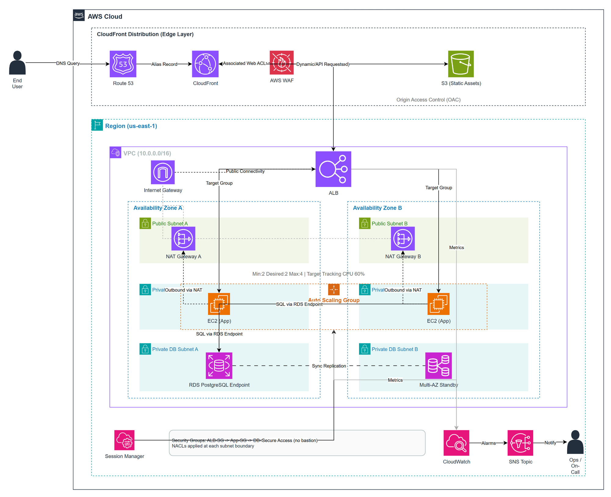

# Taleo: Scalable Web Application on AWS

Taleo is a pre-launch website that registers people interested in a personalized children's story box before the business launches. This repository presents the AWS cloud architecture proposed for hosting that website securely and at scale.

## Cloud design objective

The design uses an EC2-based three-tier architecture that separates public delivery, private application processing, and private database storage. It is designed for high availability across two Availability Zones, automatic scaling, secure administration, and operational monitoring.

## Architecture

The editable diagrams.net source is available in [`AWS_Architecture_Compact.drawio`](AWS_Architecture_Compact.drawio).

## Architecture overview

- **Edge layer:** Route 53 directs the domain to CloudFront. AWS WAF filters malicious or excessive requests.
- **Presentation layer:** CloudFront delivers static website assets from a private S3 bucket through Origin Access Control.
- **Application layer:** Dynamic and API traffic reaches an Application Load Balancer, which distributes requests to EC2 instances in private subnets.
- **Data layer:** The application connects to Amazon RDS for PostgreSQL in isolated database subnets, with a Multi-AZ standby for failover.
- **Operations layer:** Systems Manager provides administrative access without public SSH. CloudWatch and SNS provide monitoring and notifications.

## Request flow

1. Route 53 resolves the Taleo domain to CloudFront.
2. AWS WAF inspects incoming requests.
3. CloudFront serves cached static content from the private S3 origin.
4. Dynamic and API requests are sent to the public Application Load Balancer.
5. The ALB routes healthy requests to EC2 application instances across two Availability Zones.
6. EC2 instances access PostgreSQL through the RDS endpoint.
7. CloudWatch records metrics and triggers SNS notifications when an alarm threshold is reached.

## AWS services

| AWS service | Role in the architecture |
|---|---|
| Amazon Route 53 | Domain Name System and alias routing to CloudFront |
| Amazon CloudFront | Global content delivery and origin routing |
| AWS WAF | Managed and rate-based protection at the public edge |
| Amazon S3 | Private origin for static website assets |
| Amazon VPC | Network isolation for all regional resources |
| Internet Gateway | Internet connectivity for public subnets |
| NAT Gateway | Controlled outbound internet access for private EC2 instances |
| Application Load Balancer | HTTPS termination, health checks, and request distribution |
| Amazon EC2 Auto Scaling | Runs and automatically scales the application tier |
| Amazon RDS for PostgreSQL | Managed relational database with Multi-AZ failover |
| AWS Systems Manager | Session Manager access without a bastion host |
| Amazon CloudWatch | Central metrics, logs, dashboards, and alarms |
| Amazon SNS | Operational alarm notifications |

## Network design

The workload is placed in a `10.0.0.0/16` VPC in `us-east-1` and distributed across two Availability Zones. Each zone contains:

- A public subnet for the ALB and NAT Gateway
- A private application subnet for EC2 instances
- A private database subnet for RDS

The Internet Gateway serves public routes. Each private application subnet uses the NAT Gateway in its own Availability Zone for outbound traffic. Database subnets have no direct internet route.

Traffic is restricted through the security-group chain `ALB-SG -> App-SG -> DB-SG`, allowing only the required listener, application, and PostgreSQL ports.

## High availability and scaling

- The ALB and Auto Scaling Group span two Availability Zones.
- The proposed Auto Scaling capacity is minimum `2`, desired `2`, and maximum `4` EC2 instances.
- Target-tracking scaling maintains approximately `60%` average CPU utilization.
- ALB health checks remove unhealthy application instances from service.
- RDS Multi-AZ maintains a synchronous standby and provides managed failover.
- CloudFront caches static content close to users and reduces load on the regional origins.
- One NAT Gateway per Availability Zone avoids a single-zone outbound dependency.

## Security design

- The S3 bucket is private and accessible to CloudFront through Origin Access Control.
- AWS WAF protects the public entry point with managed and rate-based rules.
- EC2 and RDS have no public IP addresses.
- Security groups permit traffic only between the required tiers.
- Systems Manager Session Manager replaces direct SSH access and removes the need for a bastion host.
- HTTPS should be enforced at CloudFront and the ALB using certificates from AWS Certificate Manager.
- Application secrets should be stored in AWS Secrets Manager or Systems Manager Parameter Store, not in source control.
- Encryption should be enabled for S3, EBS, RDS, CloudWatch Logs, and data in transit.

## Monitoring and operations

CloudWatch should collect application logs and infrastructure metrics. Recommended alarms include:

- ALB unhealthy host count greater than zero
- Elevated ALB target response time or HTTP 5xx rate
- EC2 CPU utilization above the scaling target
- RDS CPU, storage, connection, and failover events
- CloudFront error-rate thresholds

Alarm actions publish to an SNS topic so the operations contact receives a notification.

## Database design

The database tier uses Amazon RDS for PostgreSQL in private database subnets. The project includes a sanitized schema and lookup seed data suitable for initializing the environment; it contains no customer registrations or credentials.

The entity-relationship diagram is available in [`Taleo_Prelaunch_ERD.drawio.xml`](Taleo_Prelaunch_ERD.drawio.xml).

## Cloud deployment sequence

1. Create the VPC, route tables, and public, application, and database subnets across two Availability Zones.
2. Attach the Internet Gateway and deploy one NAT Gateway in each public subnet.
3. Create security groups for the ALB, application, and database tiers.
4. Deploy the RDS PostgreSQL Multi-AZ database in the private database subnet group.
5. Create the EC2 launch template and Auto Scaling Group in the private application subnets.
6. Create the public ALB, target group, health checks, and HTTPS listener.
7. Upload the static website build to the private S3 bucket.
8. Create CloudFront with S3 and ALB origins, then associate AWS WAF.
9. Point the Route 53 domain record to CloudFront.
10. Configure Systems Manager, CloudWatch alarms, log retention, and SNS notifications.

## Project deliverables

- AWS architecture diagram in editable Drawio format
- AWS architecture image for documentation
- Database entity-relationship diagram
- Sanitized PostgreSQL schema and lookup seed data
- Website source code used by the proposed cloud deployment

## Deployment status

The architecture and supporting project artifacts are prepared for the cloud design assignment. A live URL can be added after the AWS resources are provisioned.
