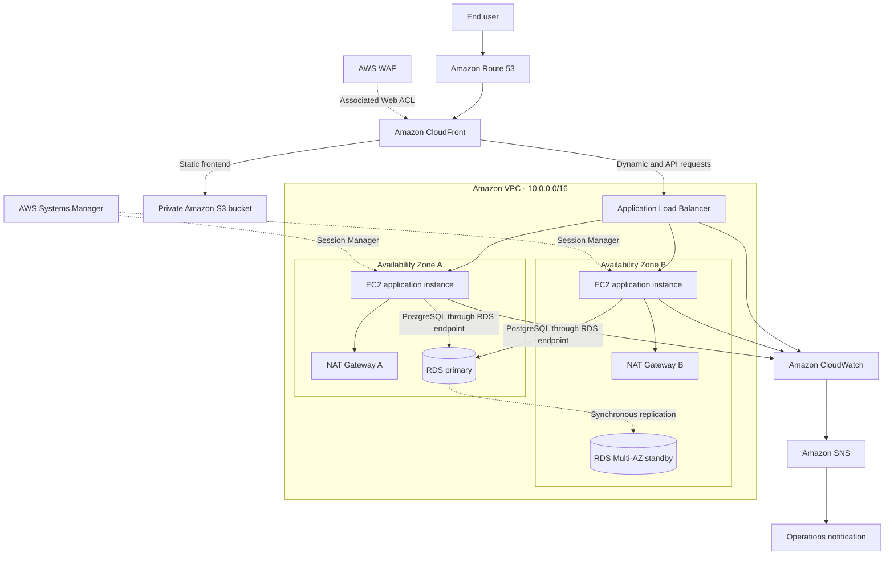

# Taleo: Scalable Web Application on AWS

Taleo is a multilingual pre-launch platform for personalized children's storybooks. It helps families register their interest in a story created around a child, their personality, and a value or habit the family wants to encourage.

This repository contains the Taleo React frontend, Express API, PostgreSQL schema, and the proposed AWS architecture for deploying the application as a highly available, scalable web platform.

## Table of contents

- [Solution overview](#solution-overview)
- [Architecture](#architecture)
- [Request flow](#request-flow)
- [AWS services](#aws-services)
- [Availability and scaling](#availability-and-scaling)
- [Security](#security)
- [Application features](#application-features)
- [Repository structure](#repository-structure)
- [Run locally](#run-locally)
- [AWS deployment outline](#aws-deployment-outline)
- [Monitoring](#monitoring)
- [Validation](#validation)
- [Deployment status](#deployment-status)

## Solution overview

The architecture follows a traditional EC2-based, three-tier design:

- A presentation tier delivered globally through Amazon CloudFront
- An application tier running the Node.js API on EC2 Auto Scaling instances
- A data tier using Amazon RDS for PostgreSQL with Multi-AZ availability

The workload is distributed across two Availability Zones. Public-facing infrastructure is placed in public subnets, while application instances and the database remain in private subnets.

## Architecture



The editable diagrams.net source is included at [`AWS_Architecture_Compact.drawio`](AWS_Architecture_Compact.drawio).

## Database ERD

The database entity-relationship diagram is available at [`Taleo_Prelaunch_ERD.drawio.xml`](Taleo_Prelaunch_ERD.drawio.xml). It documents the seven PostgreSQL tables, their primary and unique constraints, and the foreign-key relationships used by the registration and admin flows.

## Request flow

1. Route 53 resolves the Taleo domain to the CloudFront distribution.
2. AWS WAF inspects requests at the CloudFront edge.
3. CloudFront serves the compiled React application from a private S3 origin using Origin Access Control.
4. Dynamic and API requests are forwarded to the public Application Load Balancer.
5. The ALB routes healthy requests to EC2 instances in private application subnets across two Availability Zones.
6. Every application instance connects to the same RDS PostgreSQL endpoint. AWS manages primary and standby failover.
7. CloudWatch collects metrics and alarms, and SNS sends operational notifications.

## AWS services

| Service | Purpose |
|---|---|
| Amazon Route 53 | DNS and alias routing to CloudFront |
| Amazon CloudFront | Global delivery and caching for the website |
| AWS WAF | Managed and rate-based protection for public requests |
| Amazon S3 | Private storage for the compiled React frontend |
| Amazon VPC | Network isolation across public, application, and database subnets |
| Internet Gateway | Internet connectivity for public resources |
| NAT Gateway | Controlled outbound access for private EC2 instances |
| Application Load Balancer | Health checks and traffic distribution across EC2 targets |
| Amazon EC2 Auto Scaling | Runs and scales the Express backend across two Availability Zones |
| Amazon RDS for PostgreSQL | Managed relational database with Multi-AZ failover |
| AWS Systems Manager | Secure Session Manager access without a bastion host |
| Amazon CloudWatch | Logs, metrics, dashboards, and alarms |
| Amazon SNS | Alarm notifications for operators |

## Availability and scaling

- The ALB spans public subnets in two Availability Zones.
- The Auto Scaling Group spans two private application subnets.
- The proposed group configuration is a minimum of 2, desired capacity of 2, and maximum of 4 EC2 instances.
- Target-tracking scaling can maintain an average CPU utilization target of 60%.
- ALB health checks use the backend `GET /health` endpoint.
- RDS Multi-AZ provides a synchronous standby and managed database failover.
- CloudFront caches static content close to users and reduces origin traffic.

## Security

- The S3 frontend bucket remains private and is accessed only through CloudFront Origin Access Control.
- AWS WAF protects the public entry point with managed OWASP-oriented and rate-based rules.
- EC2 and RDS are placed in private subnets and receive no public IP addresses.
- Security-group flow follows `ALB-SG -> App-SG -> DB-SG` with only required ports allowed.
- Systems Manager Session Manager replaces public SSH and bastion-host access.
- Production secrets belong in a managed secret store or protected instance configuration, never in Git.
- The repository ignores environment files, private keys, generated builds, and database backups.
- The published SQL seed contains no registrations, phone numbers, user emails, or password hashes.
- Passwords are hashed with bcrypt and successful authentication returns a time-limited JWT.

## Application features

- Responsive Taleo pre-launch landing page
- English, Arabic, and Bahasa Melayu content
- Right-to-left layout support for Arabic
- Interest registration with international phone-number validation
- Printed and digital book-format preferences
- Live supporter counter
- Admin login and protected registrations dashboard
- Express rate limiting for registration, count, dropdown, and login endpoints
- PostgreSQL-backed languages, dropdown options, registrations, and users

## Repository structure

```text
.
|-- AWS_Architecture_Compact.drawio    # Editable AWS architecture diagram
|-- database/
|   `-- taleo_schema_and_seed.sql      # Schema and safe lookup seed data
|-- taleo-backend/
|   |-- scripts/                       # Admin and role-management utilities
|   |-- db.js                          # PostgreSQL connection pool
|   `-- index.js                       # Express API
`-- taleo-frontend/
    |-- public/
    `-- src/                           # React application and admin interface
```

## Run locally

### Prerequisites

- Node.js 20 or later
- PostgreSQL
- `psql`

### 1. Create the database

Create an empty PostgreSQL database and restore the safe schema and lookup records:

```powershell
createdb taleo
psql -d taleo -f database/taleo_schema_and_seed.sql
```

The seed contains languages and translated dropdown options only. It intentionally creates no registrations or users.

### 2. Configure and run the backend

```powershell
cd taleo-backend
Copy-Item .env.example .env
npm install
npm run admin:reset-password
npm start
```

Before running the admin command, configure the PostgreSQL connection and generate a strong `JWT_SECRET` in `.env`. The command securely creates the first admin account or updates an existing admin password.

The API starts at `http://localhost:4000`. Check `http://localhost:4000/health` for application and database connectivity.

### 3. Configure and run the frontend

```powershell
cd taleo-frontend
Copy-Item .env.example .env
npm install
npm run dev
```

The Vite development server normally starts at `http://localhost:5173`. Set `VITE_API_URL` to the backend URL.

## AWS deployment outline

1. Create the VPC, two Availability Zones, and public, application, and database subnets.
2. Attach an Internet Gateway and configure one NAT Gateway per Availability Zone.
3. Create the RDS PostgreSQL Multi-AZ database in the private DB subnet group.
4. Install and configure the Express backend on an EC2 launch template.
5. Create an Auto Scaling Group across the private application subnets.
6. Create a public ALB, target group, health check, and HTTPS listener.
7. Build the React frontend with the production API URL and upload `dist/` to the private S3 bucket.
8. Create the CloudFront distribution with S3 and ALB origins and associate AWS WAF.
9. Create the Route 53 alias record for the CloudFront distribution.
10. Configure CloudWatch alarms, SNS notifications, and Systems Manager access.

## Monitoring

Recommended CloudWatch alarms include:

- ALB unhealthy host count greater than zero
- ALB target response time above the accepted threshold
- EC2 Auto Scaling average CPU above the scaling target
- RDS CPU, free storage, and database connection thresholds
- HTTP 5xx error rates from CloudFront and the ALB

## Validation

Backend syntax checks:

```powershell
cd taleo-backend
npm test
```

Frontend lint and production build:

```powershell
cd taleo-frontend
npm run lint
npm run build
```

## Deployment status

The application code, safe database seed, and AWS architecture are ready for publication. The live AWS URL will be added after the cloud resources are deployed.
